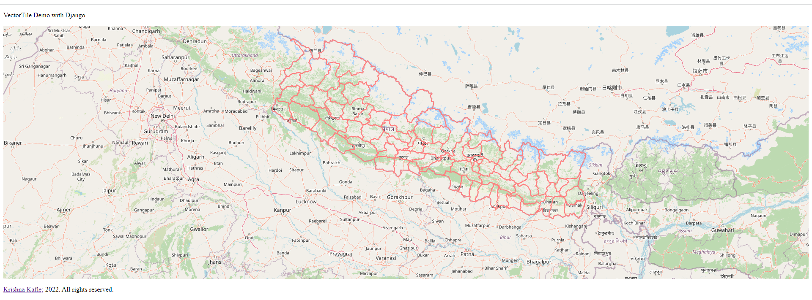
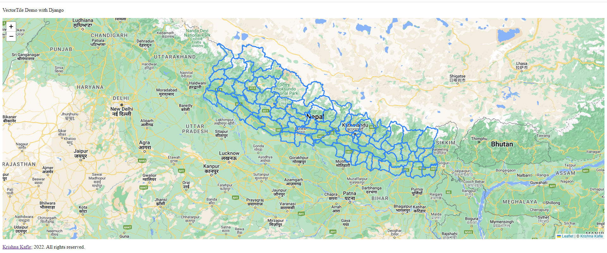

# django-vector-tiles

# Blog Post from Kafle Krishna

I have explained and demostrated the use case in following blog. Please do visit the blog for details and give feedback if you have any. https://kaflekrishna.com.np/blog-detail/calculating-different-vegetation-indices-google-earth-engine-sentinel-2-images/

## Calculating different Vegetation Indices in Google Earth Engine (Sentinel -2 images)
You are reading this article, so I assume you have faced problems loading vector layers in the web map. I will discuss visualizing the large shapefiles/geojson on web maps. So let's first dive into the concept of web mapping. Anyone working on webGIS will find this post beneficial.

I believe you are facing issues on webGIS projects where you need vector layers but can't visualize layers due to the large size of the shapefile or geojson. You may have seen a slow rendering time of a large geojson layer. Or you may have generalized the layer and tried to visualize the layer and found inconsistency between layers. You don't have to face similar issues anymore.

#### Expected Output of code is as follows:
For openlayers:

For leaflet:

